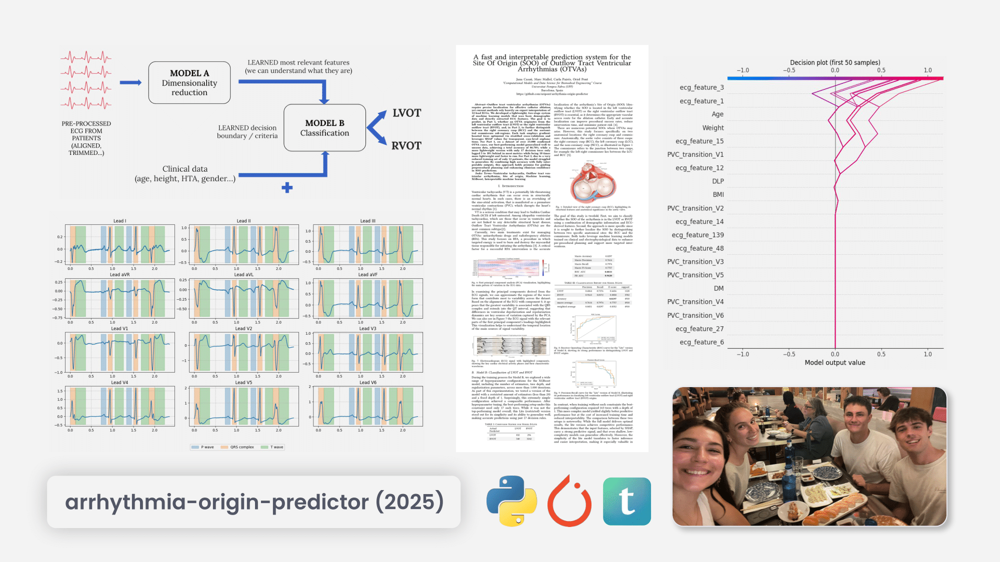

 

---

# A fast and interpretable prediction system for the Site Of Origin (SOO) of Outflow Tract Ventricular Arrhythmias (OTVAs)

#### A project for the **UPF - Computational Models and Data Science for Biomedical Engineering** course, 2025

This repository contains the development of a system of machine learning models for predicting the Site Of Origin (SOO) of Outflow Tract Ventricular Arrhythmias (OTVAs), from patient cases that consist mainly of ECGs and demographic data.




Where we have trained highly accurate models (up to 87% accuracy) that execute very fast (a few microseconds per prediction) and are highly interpretable (using SHAP values to understand feature importance, and seeing the deicision-making process of the models).

The project is structured as follows:

```plaintext
.
├── dataset/                  # Gets downloaded from the [repository release](https://github.com/uripont/arrhythmia-origin-predictor/releases/tag/dataset)
├── models/                   # Stores the trained machine learning models
│   ├── model_b/              # Model for Task 1: Left vs. Right Outflow Tract classification
│   ├── model_b_lite/         # Lightweight model for Task 1, optimized for fast inference
│   └── model_c/              # Model for Task 2: Sub-regional localization (RCC vs. Aortomitral Commissure)
├── outputs/                  # Contains various outputs from the data processing and model training, such as:
│   ├── full_segmentations.json
│   ├── full_segmentations.pkl
│   ├── other_model_families_confusion_matrices.png
│   ├── patients_taskB.pkl
│   ├── ... (various data splits and intermediate results)
│   └── ecg_images/           # Generated ECG images and visualizations
├── report/
│   ├── main.pdf              # The compiled PDF version of the analysis report
│   ├── main.typ              # Typst source file for the report
│   ├── refs.bib              # Bibliography for the report
│   └── figures/
├── .gitignore
├── project_arrhythmias.ipynb # The main Jupyter Notebook containing the end-to-end pipeline (source code)
└── requirements.txt          # Lists the Python dependencies required for the source code
```

## Introduction

OTVAs are premature ventricular beats that can lead to significant morbidity and mortality if not properly diagnosed and treated. Accurate localization of the arrhythmia's origin is crucial for effective treatment, including catheter ablation procedures; and detecting the arrhythmia's origin from purely eye-inspecting ECG data can be a challenging task.

## Project tasks

This project is divided into two main tasks, each focusing on a different aspect of the arrhythmia classification problem:

1. **Part 1: Left vs. Right Outflow Tract**  
   Classification of arrhythmia as originating from either the Left Ventricular Outflow Tract (LVOT) or the Right Ventricular Outflow Tract (RVOT).

2. **Part 2: Sub-regional localization**  
   Discrimination between origins at the Right Coronary Cusp (RCC) and the aortomitral commissure (the mitral-aortic continuity).

## Goals

The goal of this project is to develop a system of models for each task that can **accurately** predict the Site of Origin of OTVAs. Given the medical context, the system should also be **interpretable**, providing an explanation into the *learned* decision-making process of the models. Additionally, the system should have **fast and lightweight inference**, enough for real-time clinical applications running on edge devices.

## About the process

The project is designed to be **easily reproducible**, with all the code and data organized in a clear and structured manner. This is why the whole end-to-end pipeline is contained in a single Jupyter Notebook ([project_arrhythmias.ipynb](project_arrhythmias.ipynb)), which includes all the steps from data preprocessing to model evaluation. This notebook explains our approach in detail, and can be executed to reproduce the results on any machine.

Moreover, the results of the projects are summarized in a [report](report.pdf), which provides an overview of the methods used, the results obtained, and the main conclusions drawn from the analysis in 8 pages.

## Requirements

- Python 3.8 or higher
- Jupyter Notebook
- Required Python packages listed in `requirements.txt`

It's recommended to create a virtual environment and install the required packages using:

```bash
python -m venv venv
source venv/bin/activate  # On Windows use `venv\Scripts\activate`
pip install -r requirements.txt
```

Then the kernel should be detected automatically by Jupyter Notebook.
